# Resource Flows

Complete documentation of each resource type's creation flow, data model, and final output.

---

## Shared Infrastructure

All resources share these systems:

```mermaid
block-beta
  columns 4
  block:styles["Styles"]:1
    s1["Colors"]
    s2["Typography"]
    s3["Illustration style"]
    s4["Frames"]
  end
  block:chars["Characters"]:1
    c1["Name"]
    c2["promptFragment"]
    c3["Description"]
    c4["Per-item mode"]
  end
  block:assets["Assets"]:1
    a1["Versioning"]
    a2["History"]
    a3["Pinning"]
    a4["Pruning (max 10)"]
  end
  block:tags["Tags"]:1
    t1["string[] per resource"]
    t2["Normalize + dedup"]
  end

  style styles fill:#f9d5c7,stroke:#e67e5a
  style chars fill:#c7e8f0,stroke:#5ab5cc
  style assets fill:#d5e8d4,stroke:#82b366
  style tags fill:#e8e0f0,stroke:#9673b9
```

**How they connect:**
- **Styles** → applied to all image generation prompts + PDF color/font rendering
- **Characters** → `promptFragment` prepended to image prompts for visual consistency
- **Assets** → every generated image stored with full prompt for regeneration
- **Tags** → lightweight organization on each resource

### Two Wizard Patterns

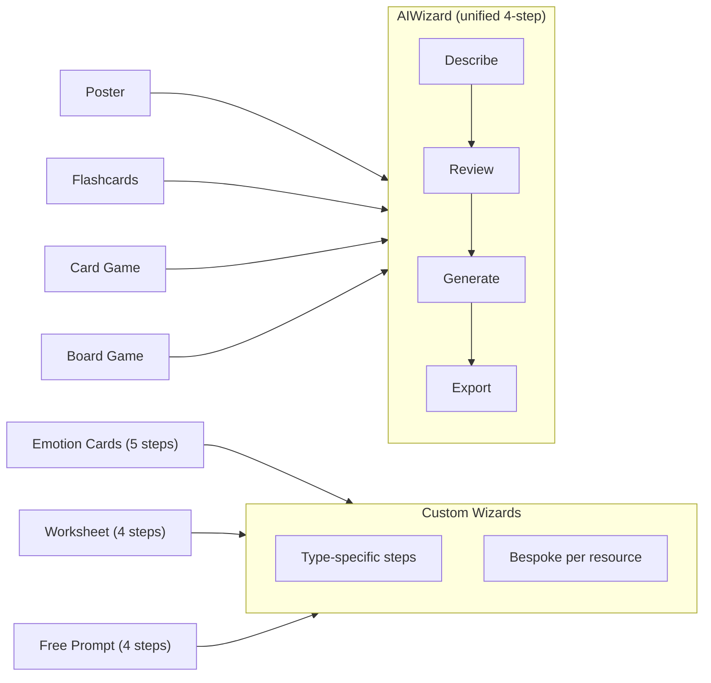

---

## 1. Emotion Cards

The most mature resource type. Custom 5-step wizard with frame support.

**Purpose:** Deck of illustrated emotion cards for therapy sessions — children identify and discuss feelings using visual aids.

### Creation Flow

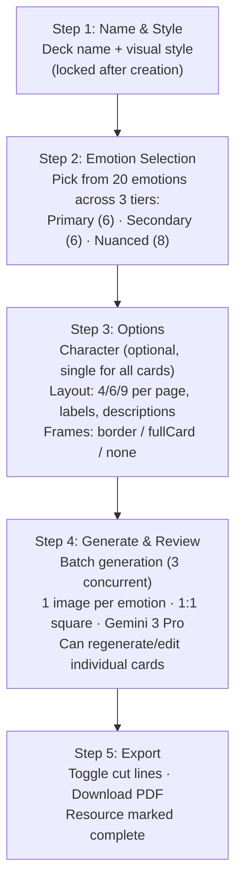

### Card Anatomy

```
+-------------------------+
|                         |
|                         |
|    AI-generated         |    75% of card height
|    illustration         |    1:1 aspect ratio
|    (emotion scene)      |
|                         |
|                         |
+-------------------------+
|  Happy                  |    Label (heading font)
|  Feeling good           |    Description (body font)
+-------------------------+

Optional frame overlays:
+- - - - - - - - - - - - +    Border frame (decorative edges)
|  +-------------------+  |        OR
|  |     content       |  |    Full-card frame (template
|  +-------------------+  |    with transparent center)
+- - - - - - - - - - - - +
```

### Final PDF Output

```
A4 Page (example: 6 cards per page, 2x3 grid)
+---------------------------------------+
|  +-----------+  +-----------+         |
|  |  Happy    |  |   Sad     |         |
|  |  [img]    |  |  [img]    |         |
|  |  label    |  |  label    |         |
|  +-----------+  +-----------+         |
|  +-----------+  +-----------+         |
|  |  Angry    |  | Scared    |         |
|  |  [img]    |  |  [img]    |         |
|  |  label    |  |  label    |         |
|  +-----------+  +-----------+         |
|  +-----------+  +-----------+         |
|  |Surprised  |  |Disgusted  |         |
|  |  [img]    |  |  [img]    |         |
|  |  label    |  |  label    |         |
|  +-----------+  +-----------+         |
|                                       |
|  - - - - - - - - - - - - - - -       |  Optional cut lines
+---------------------------------------+

Grids: 4 (2x2), 6 (2x3), or 9 (3x3) cards per A4 page
Margins: 36pt (0.5")
Fonts: style's heading + body fonts
Colors: style's color palette
```

### Unique Features
- **Frame assets** — AI-generated decorative frames (chroma key -> transparency)
- **Card layout settings** — text position (bottom/overlay/integrated), content height, image overlap
- **Per-style defaults** — frame usage inherited from style's `defaultUseFrames`

---

## 2. Card Game

Most sophisticated architecture. Template-based composition system.

**Purpose:** Custom card game decks (UNO-style or custom rules). A small set of reusable backgrounds + icons compose into 30-100+ unique cards efficiently.

### Creation Flow

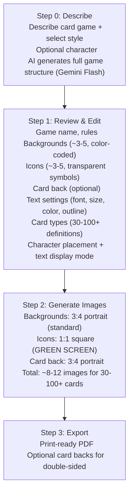

### Card Composition (how ~10 images become 50+ cards)

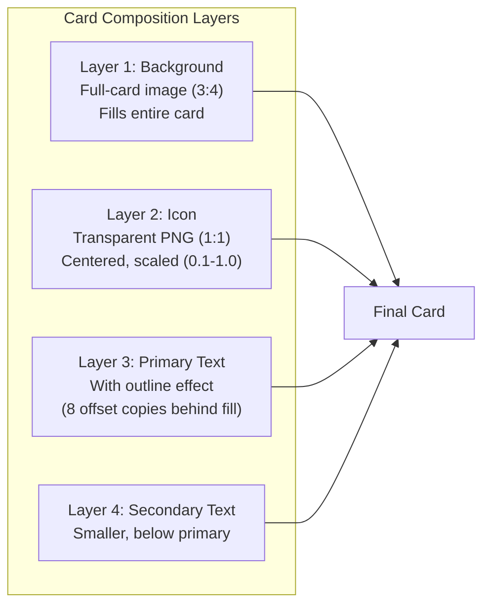

### Icon Generation Pipeline

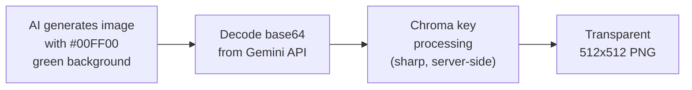

### Final PDF Output

```
A4 Page (9 cards per page, 3x3 grid)
+------------------------------------------+
|  +--------+  +--------+  +--------+      |
|  |Red bg  |  |Red bg  |  |Blue bg |      |
|  |  "1"   |  |  "2"   |  |  "1"   |      |
|  +--------+  +--------+  +--------+      |
|  +--------+  +--------+  +--------+      |
|  |Blue bg |  |Red bg  |  |Blue bg |      |
|  |  "2"   |  | Skip   |  | Reverse|      |
|  +--------+  +--------+  +--------+      |
|  +--------+  +--------+  +--------+      |
|  |Green   |  |Green   |  | Wild   |      |
|  |  "1"   |  |  "2"   |  | card   |      |
|  +--------+  +--------+  +--------+      |
+------------------------------------------+

Optional: card back pages interleaved for double-sided printing
+------------------------------------------+
|  +--------+  +--------+  +--------+      |
|  | xxxxxx |  | xxxxxx |  | xxxxxx |      |
|  | xxxxxx |  | xxxxxx |  | xxxxxx |      |  Decorative
|  | xxxxxx |  | xxxxxx |  | xxxxxx |      |  card back
|  +--------+  +--------+  +--------+      |  pattern
|  ...                                     |
+------------------------------------------+

Each card type expanded by its `count` field
(e.g., "Red 1" x 2 = two physical cards in the PDF)
```

### Unique Features
- **Template composition** — generate ~10 images, compose 50+ unique cards
- **Chroma key icons** — green screen -> transparent PNG pipeline
- **Text outline rendering** — 8 offset copies simulate stroke effect in PDF
- **Character placement modes** — backgrounds only / icons only / both / none
- **Text display modes** — all / numbers_only / none

---

## 3. Poster

Simplest AI-driven resource. Single image with headline text.

**Purpose:** Therapy room wall poster — visual reminder (e.g., "Take a Breath") with an illustration.

### Creation Flow

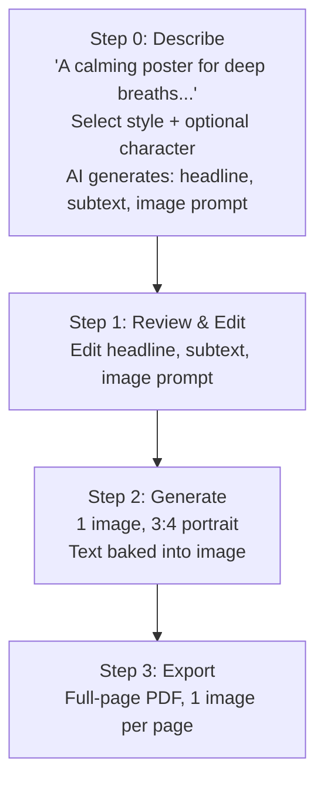

### Final PDF Output

```
A4 Page (full-page layout)
+---------------------------------------+
|  +---------------------------------+  |
|  |                                 |  |
|  |                                 |  |
|  |    AI-generated poster          |  |
|  |    illustration                 |  |
|  |    (3:4 portrait)               |  |
|  |                                 |  |
|  |    Text baked in by AI          |  |
|  |    during generation            |  |
|  |                                 |  |
|  |                                 |  |
|  +---------------------------------+  |
|                                       |
|  36pt margins on all sides            |
+---------------------------------------+
```

---

## 4. Flashcards

Multi-card resource with front/back text and individual illustrations.

**Purpose:** Coping skills, vocabulary, or concept cards — children flip cards to learn associations.

### Creation Flow

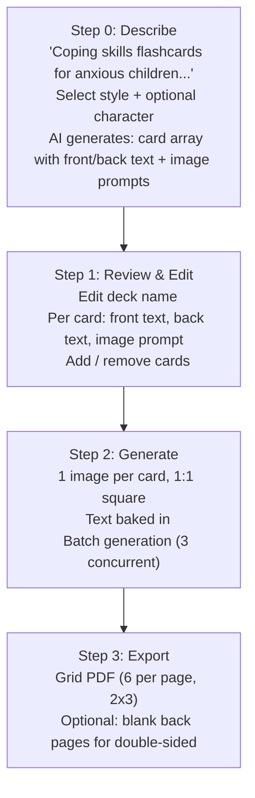

### Final PDF Output

```
A4 Page (6 cards per page, 2x3 grid)
+---------------------------------------+
|  +------------+  +------------+       |
|  | Breathe    |  | Stretch    |       |
|  |   [img]    |  |   [img]    |       |
|  +------------+  +------------+       |
|  +------------+  +------------+       |
|  | Name it    |  | Ask for    |       |
|  |   [img]    |  |   help     |       |
|  +------------+  +------------+       |
|  +------------+  +------------+       |
|  | Ground     |  | Squeeze    |       |
|  |   [img]    |  |   [img]    |       |
|  +------------+  +------------+       |
+---------------------------------------+

Optional: blank back pages for double-sided printing
```

---

## 5. Board Game

Grid-based game board with tokens and instruction cards.

**Purpose:** Therapeutic board games — children advance through spaces completing activities or answering prompts.

### Creation Flow

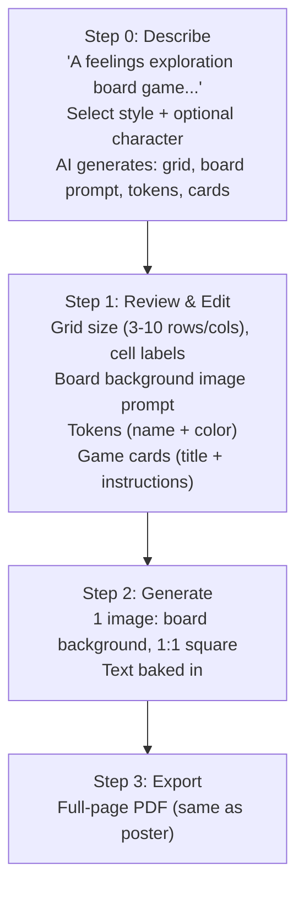

### Final PDF Output

```
A4 Page (full-page layout)
+---------------------------------------+
|  +---------------------------------+  |
|  |                                 |  |
|  |   AI-generated board game       |  |
|  |   illustration with grid        |  |
|  |                                 |  |
|  |   +--+--+--+--+--+--+          |  |
|  |   | 1| 2| 3| 4| 5| 6|          |  |
|  |   +--+--+--+--+--+--+          |  |
|  |   |12|11|10| 9| 8| 7|          |  |
|  |   +--+--+--+--+--+--+          |  |
|  |   |..|..|..|..|..|..|          |  |
|  |   +--+--+--+--+--+--+          |  |
|  |                                 |  |
|  +---------------------------------+  |
+---------------------------------------+

Note: Grid structure is part of the AI-generated image,
not rendered separately in the PDF.
```

---

## 6. Worksheet

Structured form with block-based content builder. Custom wizard (not AI-driven).

**Purpose:** Therapy worksheets with prompts, checklists, rating scales, and writing spaces — printed handouts for in-session activities.

### Creation Flow

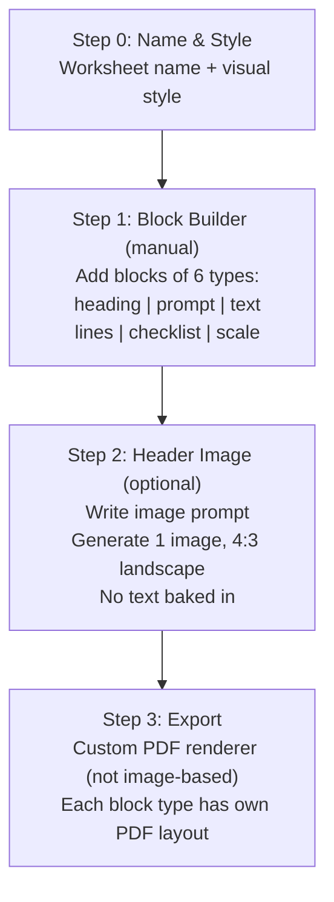

### Block Types

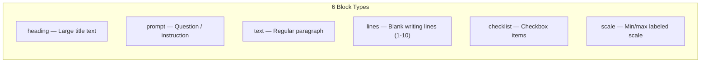

### Final PDF Output

```
A4 Page (custom block rendering)
+---------------------------------------+
|                                       |
|  +---------------------------------+  |
|  |   [Optional header image]       |  |  4:3, 160px height
|  +---------------------------------+  |
|                                       |
|  My Feelings Journal                  |  heading block
|  ---------------------------          |
|                                       |
|  How are you feeling today?           |  prompt block
|                                       |
|  _________________________________    |
|  _________________________________    |  lines block (3 lines)
|  _________________________________    |
|                                       |
|  Things I tried today:                |  prompt block
|                                       |
|  [ ] Deep breaths                     |
|  [ ] Named my feeling                 |  checklist block
|  [ ] Asked for help                   |
|                                       |
|  How intense was it?                  |  prompt block
|  Not at all ----------- Very much     |  scale block
|                                       |
+---------------------------------------+

Blocks are rendered as styled text/shapes in the PDF,
NOT as images. Style colors applied to text and lines.
```

### Unique Features
- **Block-based editor** — only resource type with structured form content
- **No AI content generation** — blocks are manually composed
- **PDF renders blocks natively** — text, lines, checkboxes, scales as PDF primitives
- **Optional header image** — only decorative element that uses AI generation

---

## 7. Free Prompt

Open-ended single-image generation. Simplest resource type.

**Purpose:** Anything that doesn't fit the structured types — custom illustrations, activity visuals, or therapeutic imagery.

### Creation Flow

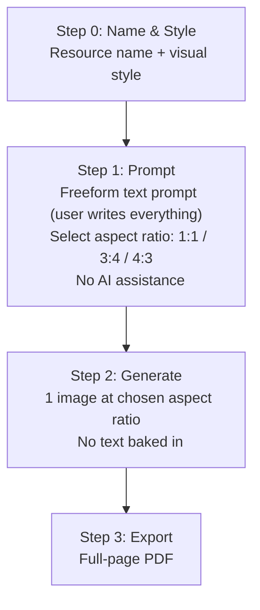

### Final PDF Output

```
A4 Page (full-page layout)
+---------------------------------------+
|  +---------------------------------+  |
|  |                                 |  |
|  |   User-prompted                 |  |
|  |   AI illustration               |  |
|  |                                 |  |
|  |   (1:1, 3:4, or 4:3            |  |
|  |    based on selection)          |  |
|  |                                 |  |
|  +---------------------------------+  |
|                                       |
|  36pt margins                         |
+---------------------------------------+
```

---

## Comparison Matrix

| Feature | Emotion Cards | Card Game | Poster | Flashcards | Board Game | Worksheet | Free Prompt |
|---|---|---|---|---|---|---|---|
| **Wizard** | Custom 5-step | AIWizard | AIWizard | AIWizard | AIWizard | Custom 4-step | Custom 4-step |
| **AI content gen** | No (predefined) | Yes (Gemini Flash) | Yes | Yes | Yes | No | No |
| **Images generated** | 1 per emotion | ~8-12 templates | 1 | 1 per card | 1 | 0-1 | 1 |
| **Image aspect** | 1:1 | 3:4 + 1:1 icons | 3:4 | 1:1 | 1:1 | 4:3 | User choice |
| **Text in image** | Configurable | Via PDF overlay | Yes (baked) | Yes (baked) | Yes (baked) | No | No |
| **Character** | Single for all | Placement modes | Optional | Optional | Optional | No | No |
| **PDF layout** | Grid (4/6/9) | Grid (9) + backs | Full page | Grid (6) | Full page | Block renderer | Full page |
| **Frames** | Yes | No | No | No | No | No | No |
| **Double-sided** | No | Yes (card backs) | No | Yes (blank backs) | No | No | No |
| **Unique** | Frames + layout | Template composition | Simplest AI flow | Front/back cards | Grid editor | Block builder | Aspect ratio choice |

---

## Image Generation Pipeline (All Types)

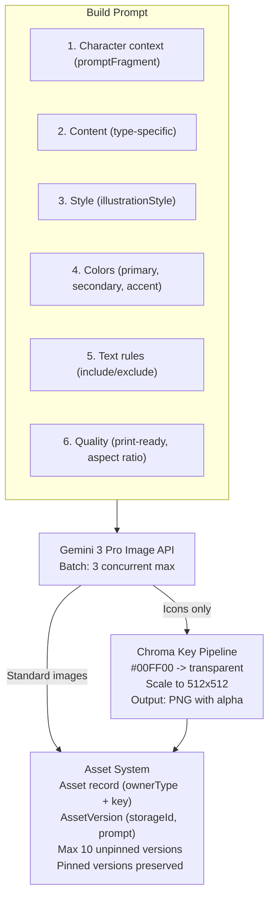

---

## PDF Generation Approaches

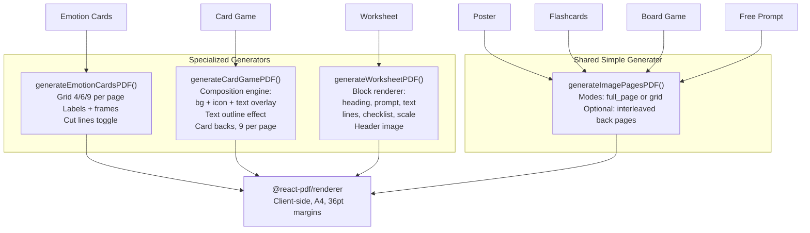
